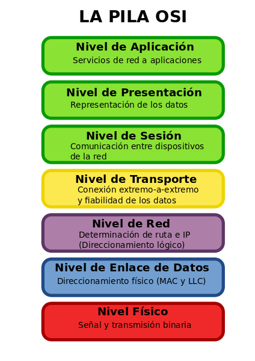
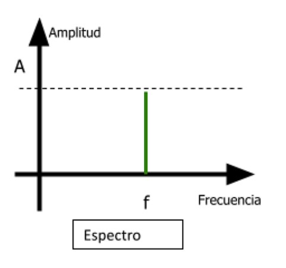
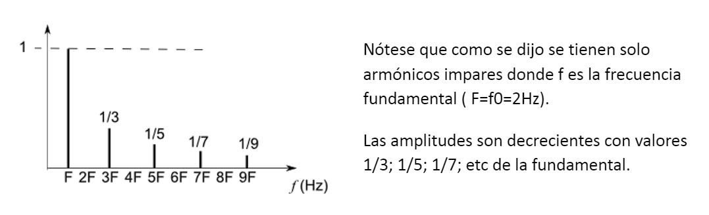
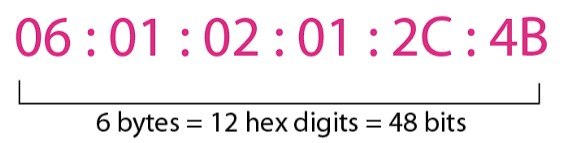

# **Tecnología de la información**

## Introducción

### El bit

- Mide la información.
- Se relaciona con la probabilidad de ocurrencia.

### información

- Es inversamente proporcional a la probabilidad de ocurrencia.
- Se mide en bits.

> #### **I = log2(1/Pa)**

### Entropía

- La entropía se relaciona con el desorden
- No es posible comprimir estadísticamente un mensaje/archivo más allá de su entropía.

### Transmisión de datos

- El éxito de una transmisión depende de:
  - Calidad de señal a transmitir.
  - Características del medio de transmisión.

### El baudio

- Representa el número de símbolos por segundo en un medio de transmisión.
- Es la velocidad de modulación

> 2n bits = n estados (niveles)

### Modelo Simplificado de Comunicaciones

> #### **Fuente &rarr; Transmisor &rarr; Canal &rarr;  Receptor &rarr; Destino**

### Módem

- Adapta el generador al medio.
- Acepta la señal de la red y la adapta al destino.

### Modelo de Referencia

#### Modelo OSI

>

1. **Física**: Capa relacionada con las características mecánicas, eléctricas y funcionales de acceso al medio físico. Trata con la transmisión de bits.
2. **Enlace de datos**: Detección y correción de errores. Divide la transmisión en tramas y las retransmite en caso de no recibir reconocimiento de llegada.
3. **Red**: Controla la operación de la "Subnet". Decide cómo se enrutan los paquetes.

## Formas de Ondas

### Señal analógica

- Responde a un pulso continuo de onda EMH.
- Se puede muestrear para conseguir una señal discreta.
- Puede tomar valores discretos entre un mínimo y un máximo.
- Varía de forma contínua a lo largo del tiempo.

---

### Señal digital

- Sólo puede tomar determinados valores.
- Cuando toma sólo dos valores, se llama binaria.

---

### Señales discretas

#### Dominio y rango contínuo

- Son las señales analógicas.

#### Dominio contínuo rango discreto

- Son las señales digitales.

#### Dominio discreto rango contínuo

- Este tipo de señal es enórmemente empleado en interfaces de comunicaciones, pues la voz humana es contínua. Se suelen tomar muestras en instantes de tiempo predeterminados.

---

### Onda Sinusoidal

Onda pura a partir de la cual pueden formarse las demás.

- **Amplitud pico**: es la máxima excursión de la señal en un sentido, A ó -A. Se mide en Volts.
- **Amplitud pico a pico**: es la máxima excursión total, 2A.
- **Frecuencia (f)**: es la cantidad de ciclos por unidad de tiempo (segundos). Se mide en Hz o cíclos por segundo.
- **Ciclo**: es el mínimo intervalo de repetición.
- **Período (T)**: Duración del ciclo medido en segundos. La cantidad de tiempo que una señal necesita para completar un ciclo.
- **Fase**: Posición relativa de la señal dentro de un período de la misma. Respecto del instante 0. Se mide en grados o radianes.

#### Longitud de Onda (λ)

- Es la distancia ocupada por un ciclo.
- Es la distancia entre dos puntos correspondientes de ciclos sucesivos.

> #### **λf = v**

> #### **λ = vT**

- A mayor frecuencia, la longitud de onda λ disminuye.

> #### **c = 3 x 10 8 m/seg.** &rarr; **300.000 km/seg. (vel. luz en el vacío)**

#### Espectro de Onda

Es la amplitud en función de la frecuencia en vez de en función del tiempo.

---

### Onda cuadrada

Es la suma de infinitas ondas seno de A decrecientes.

- Espectro: es una sucesión de líneas correspondientes a armónicas impares de la frecuencia **f0** (1/T) de la onda cuadrada.

- El espectro de una onda cuadrada está formado por ***infinitas*** ondas sinusoidales, amplitud decreciente.

  > **f0 3f0 5f0 ...**

---

### Ancho de Banda

- Es el rango de frencuencias dentro del cual se transmite una señal.
- Indica la capacidad de datos de un canal de comunicación.
- Cuanto mayor es el ancho de banda, mayor es la cantidad de információn que se puede transmitir en un período de tiempo dado.

> **Ancho de Banda = Frecuencia más alta - Frecuencia más baja**

---

### Ejercicios Resueltos

---

### Ruidos

#### Ruido térmico

- Agitación térmica de los electrones.
- No se puede eliminar.
- Es aditiva.

#### Ruido de Intermodulación

- Una señal contiene dos o más frecuencias diferentas.
- Genera distintas frecuencias sobre el mismo medio.
- Causado por la no linearidad (ningún canal es lineal)
- Se generan frecuencias múltiplos.

#### Diafonía

- Acoplamiento de una línea con otra.
- Cada señal es modificada por la otra.

#### Ruido Impulsivo

- interferencia que se caracteriza por impulsos repentinos y no deseados de energía.
- Puede ser causado por una variedad de factores:

  - Descargas electrostáticas.
  - Conmutación de equipos eléctricos.
  - Interferencias de radiofrecuencia.
  - Otros fenómenos eléctricos transitorios.

---

## Tres Teoremas

### Fourier

#### ***Toda señal periódica se puede considerar formada por la suma de infinitos senos y cosenos.***

En el caso particular de una **onda cuadrada**, está compuestra por la sumatoria de infinitas ondas sinodales; se tiene la fundamental y las armónicas impares.

> a) Sen(x)
>
> b) 1/3 Sen (3x)
>
> c) 1/5 Sen (5x)

- A medida que se van agregando componentes (tres en este caso) la sumatoria de la señal cada vez se va pareciendo más a una onda cuadrada. 

- Fourier demostró que cuando la cantidad de componentes sumados sean infinitos, la onda será exactamente una onda cuadrada.

#### Filtro

Dispositivo que deja pasar un rango de componentes de frecuencia y anula el resto.

- **Filtro pasa alto**: pasa todo lo que está arriba de f de corte.
- **Filtro pasa bajo**: pasa todo lo que esté por debajo de la f de corte.
- **Filtro pasa banda**: pasa todo lo que esté entre dos frecuencias.

---

### Nyquist

#### ***Toda señal limitada en banda se puede recuperar completamente muestreándola al doble de su máxima frecuencia.***

- Basta con dos muestras por ciclo.
- Alcanza con transmitir las muestras.

> **Capacitdad del Canal:** 
>
> #### **2B Log2 N**

*Si es cuaternaría, N vale 4. Si es binaria, vale 2*

---

### Shannon

#### ***La capacidad de un canal de comunicaciones es proporcional a su ancho de banda y el logaritmo de su relación señal/ruido.***

> #### C = BW Log2 (1 + S/N)

*Donde **C** es la capacidad en bps, **BW** el ancho de banda, y **S/N** la relación Señal/ruido en veces.*

- Por ejemplo, supongamos un canal telefónico donde **B**=4000Hz; **S/N**= 1000; se tendrá que 40000bps es la máxima capacidad posible de este canal.

> *Ayuda para los logaritmos*
>
> logab = log b / log a

 

---

## Medios Guiados

### Par trenzado

- Tiene esa forma para minimizar la interferencia entre pares.
- Sirve para transmisión analógica como digital.
- Consiste en pares de cables aislados y trenzados en forma de espiral.
- Mediante el trenzado se disminuye la radiación, las Interferencias electromagnéticas.
- Es susceptible a interferencias y ruido.
-Se conocen como cables UTP.

> **Analógicas** &rarr; Amplificadores cada 5 ó 6 Kms.
>
> **Digitales** &rarr; Repetidores cada 2 ó 3 Kms.
>
> **Velocidad de Transmisión** &rarr; 100Mbps - 10Gbps
 

---

### Cable Coaxial

- Ancho de banda cercano a 1Ghz.
- Excelente inmunidad al ruido.
- Más barato que la fibra óptica y más caro que el UTP.
- Facilidad de instalación.

---

### Fibra Óptica

**Ventajas sobre el cobre:**

- Mayor ancho de banda.
- Baja atenuación &rarr; Pocos repetidores.
- Inmunidad al ruido.
- Menor tamaño físico.
- Menor peso.

**Desventajas:**

- Se dañan fácilmente.
- Comunicación unidireccional
- Requiere interfaces caras.

**Componentes de los filamentos:**
- **La fuente de luz**: LED o Láser.
- **Medio transmisor**: Fibra Óptica.
- **Detector de luz**: Fotodiodo.
 
 

**Comparación Diodos-LED como fuente de luz.**

| Elemento                | LED       | Láser        |
|-------------------------|-----------|--------------|
| Tasa de datos           | Baja      | Alta         |
| Tipo de Fibra           | Multimodo | Multi/Mono   |
| Distancia               | Corta     | Larga        |
| Tiempo de vida          | Largo     | Corto        |
| Sensibilidad a la temp. | Menor     | Considerable |
| Costo                   | Bajo      | Elevado      |

 
 

#### Multimodo índice escalón

La fibra óptica multimodo de índice escalón es un tipo de fibra óptica en la que la luz puede seguir múltiples trayectorias (o modos) a lo largo de la fibra.

- La "índice escalón" se refiere a la variación del índice de refracción dentro de la fibra.
- En estas fibras, el núcleo (la parte central de la fibra donde se propaga la luz) tiene un índice de refracción constante, y la cubierta que rodea al núcleo tiene otro índice de refracción también constante pero menor que el del núcleo.
- Esta configuración genera una especie de "salto" o "escalón" en el índice de refracción en la interfaz entre el núcleo y la cubierta, lo que mantiene la luz confinada dentro del núcleo de la fibra a medida que se propaga.
- Simples y económicas de fabricar.
- Se pueden desfazar.
- Hay un límite de ángulo, sino el rayo de luz ya no se reflejaría y refractará.

#### Multimodo índice gradual

- El núcleo tiene índice refractivo que disminuye gradualmente con el incremento de la distancia.
- Se van formando como ondas.

#### Monomodo

- Es la FO más delgada y sólo permite viajar al rayo óptico central.
- No sufre problemas de atenuación.
- Distancias mayores.
- Difícil de construir.
- Más costosa.

#### Atenuación en FO

1. Pérdidas debido al acoplamiento con dispositivo emisor de luz.
2. Pérdidas por absorción.
3. Pérdidas debido a Scattering Rayleigh, por ser material poroso.
4. Pérdidas de Scattering debido a la no uniformidad en la estructura del núcleo.
5. Presión lateral externa causa microcurvaturas.
6. Reflexión de Fressnel (la onda/rayo se transmite a otro medio).
7. Pérdidas por radiación causadas por curvaturas.
8. Pérdidas por Splicing (unión de fibras).
9. Pérdidas por acoplamiento con el receptor de luz.

#### Comparación entre FO y Cobre

| Elemento       | FO                   | Cobre         |
|----------------|----------------------|---------------|
| Ancho de banda | Mayor                | Menor         |
| Distancia      | 30km                 | 5km           |
| Interferencias | No se ve afectada    | Muy sensible  |
| Peso/Tamaño    | Más delgada y ligera | Pesada        |
| Dirección      | Unidireccional       | Bidireccional |

#### Comparación entre tipos de Cables

| Tipo Cable / Características | Par Trenzado | Coaxial  | Fibra Óptica |
|------------------------------|--------------|----------|--------------|
| Ancho de banda               | Moderado     | Grande   | Muy grande   |
| Longitud                     | Pequeña      | Moderada | Muy alta     |
| Fiabilidad                   | Moderada     | Alta     | Muy alta     |
| Seguridad                    | Baja         | Modesta  | Alta         |
| Complejidad de instalación   | Sencilla     | Moderada | Compleja     |
| Costo                        | Bajo         | Moderado | Alto         |

---

## Medios NO Guiados

### Ondas de Radio

#### Propiedades

- Reflexión
  - Es un rebote, típicamente un espejo. La onda llega y refleja en un ángulo igual al que incide.
  - Si la superficie es rugosa, puede llegar a tomar un ángulo distinto al rebotar.

- Refracción
  - La transición de un medio a otro produce la flexión de las ondas (como en el agua).

- Difracción
  - La onda de radio se "dobla" en bordes afilados.
  - Pasa en picos de montaña.

#### Transmisiones de Radio

1. Ondas Superficiales
  - Siguen la corvatura de la tierra.
  - Ej. Radio AM.

2. Rebote en Ionósfera
  - Varían constantemente (hora a hora)

#### Satélites de Comunicaciones

| Altitud    | Tipo | Latencia | Sat. Necesarios |
|------------|------|----------|-----------------|
| >35000     | GEO  | 270      | 3               |
| 15000-5000 | MEO  | 35-85    | 10              |
| >5000      | LEO  | 1-7      | 50              |

#### Punto a Punto

La señal de radio se transmite directamente desde una ubicación (el punto de origen) a otra ubicación específica (el punto de destino).

- Este tipo de comunicación suele utilizarse para conectar dos ubicaciones fijas, como dos edificios o torres.
- Generalmente se establece un enlace de radiofrecuencia dedicado entre los dos puntos.
- Este enlace puede proporcionar una conexión de alta capacidad que es adecuada para servicios como el acceso a internet de banda ancha o la transmisión de voz y datos.

#### Broadcast

- Un transmisor envía la señal a una antena y luego existen múltiples receptores de la misma.

## Modulación

- Una señal se modula para mejorar la eficiencia de la propagación.
- Ajustar la señal al medio de transmisión.
- Distribuir canales a cada información distinta.

### Modulación ASK

***Amplitud Modulada*** 

- Medio analógico.
- Diferentes amplitudes representan valores.
- Generalmente una amplitud es cero &rarr; representa cero (ausencia de portadora).
- Más vulnerable que FSK.
- Menor calidad.

- Se generan armónicas opuestas en modo de espejo.
- Se trabaja con una portadora.

> 701Khz
>
> Rango: 6Khz

### Modulación FSK ()

***Frecuencia Modulada***

- Diferencias de frecuencias
- Menor susceptibilidad a errores que la modulación ASK.
- Se necesitan dos portadoras, por lo tanto se transmiten cuatro portadoras.
- Se dispone de un mayor ancho de banda.
- Ancho de banda total &rarr; 200Khz. 100 de cada lado.

> 95.9Khz
>
> Rango: 16Khz
>
> /4 portadoras &rarr; 4Khz

### Modulación BPSK

- Una fase para el 0 y otra para el 1.
- Una misma A y una misma frecuencia.

### Modulación DPSK

- Dos fases y una sola frecuencia.
- El 1 cambia de fase, es por comportamiento.

---

## Manejo de Tramas

### Funciones de la Capa de Enlace de Datos

- Armado de tramas
- Control de errores
- Control de flujo

### Trama

- Una trama es la unidad básica de datos transmitida entre dispositivos.

| Header  |    Payload     |   Trailer
|---------|----------------|--------------|

- Cada trama contiene información específica necesaria para la entrega y el procesamiento de los datos.

   

### Errores

- Durante la transmisión pueden aparecer errores.
- En la recepción hay que comprobar si ha habido error.
- La detección se hace mediante códigos detectores de error:
  - Estos códigos incorporan a los datos, antes de ser transmitidos, información adicional que le sirve al receptor para saber si ha habido un error durante la transmisión.

#### Qué hacer con un error?

- Para corregir los errores se pueden emplear dos estrategias:

  - **FEC (Forward Error Correction)**: añade información de control que permitirá al receptor reconstruir la información correcta.

  - **ARQ (Automatic Repeat Request)**: el receptor solicita al transmisor el reenvío de la información correcta.

#### Control de Paridad

- Es una técnica simple  de detección de errores utilizada en comunicaciones y sistemas de almacenamiento de datos.

- Funciona añadiendo un bit adicional, llamado bit de paridad, a los datos que se van a transmitir o almacenar.

- Cuando se recibe la trama de datos, el receptor calcula la paridad de los datos recibidos y la compara con el bit de paridad.

- Si no coinciden, entonces se asume que ha ocurrido un error durante la transmisión.

- Es importante tener en cuenta que el control de paridad solo puede detectar un número impar de errores de bits. **Si el número de errores es par, pasarán desapercibidos.**

## ARQ (Control de Flujo)

.

- El término "ventana" se refiere a la cantidad de paquetes que pueden estar "en vuelo" (enviados pero aún no confirmados) al mismo tiempo. La ventana "se desliza" a medida que el emisor recibe confirmaciones para los paquetes enviados, permitiendo que se envíen más paquetes.

- Este protocolo es útil para asegurar que el emisor no sature al receptor con más datos de los que puede manejar.

- También proporciona una forma de retransmitir los paquetes perdidos y mantener el orden de los paquetes a medida que se envían a través de la red.

#### Procedimientos de Ventana Corrediza

- **Protocolo de un bit**: Es el más simple, permite que el emisor envíe un solo paquete a la vez antes de requerir un acuse de recibo (ACK) del receptor. Una vez que el emisor recibe el ACK, puede enviar el siguiente paquete. La "ventana" en este caso es solo de un paquete.

- **Ventana Go-Back-N**: Este método permite que el emisor envíe múltiples paquetes (hasta N) sin esperar un ACK después de cada uno. Si se pierde un paquete, el emisor "retrocede" y retransmite ese paquete y todos los que le siguen, incluso si algunos fueron recibidos correctamente.

- **Repetición Selectiva**: Al igual que GBN, RS permite que el emisor envíe varios paquetes a la vez. Sin embargo, en lugar de retransmitir todos los paquetes después de una pérdida, SR solo retransmite el paquete perdido. Esto puede ser más eficiente que GBN si la tasa de pérdida de paquetes es alta.

## Protocolos de Acceso al Medio

### Aloha

- Diseñado para la comunicación entre estaciones de radio.

- Puro (18% de utilización máxima)
  - Cada estación (o nodo) en la red que tiene datos para enviar, los envía inmediatamente.
  - Las tramas se transmiten en tiempos arbitrarios.
  - Se envía una trama, y si en el tiempo de ida y vuelta no se recibe confirmación (2 veces el tiempo de transimsión de una trama), se reenvía.
  - No hace falta sincronización entre las estaciones.

### Aloha Ranurado

- El ALOHA ranurado es una versión mejorada del protocolo ALOHA puro. La principal diferencia es que en ALOHA ranurado, el tiempo se divide en ranuras discretas y las estaciones solo pueden comenzar a transmitir al comienzo de una ranura de tiempo.

- La eficiencia máxima teórica de ALOHA ranurado es del 37%, en comparación con el 18% de ALOHA puro.

- Se require de un reloj global.

### CSMA

- CSMA está todo el tiempo sensando la portadora para ver si hay transmisiones activas.
- Si el canal no está ocupado, se transmite.
- Si el canal está ocupado, se espera a que quede libre y se transmite (1-persistente).

---

### Algoritmos de Persistencia

#### No persistente

- Si el canal está ocupado, se espera un tiempo aleatorio y se vuelve a intentar.

#### 1-persistente

- Se espera a que esté libre, continúa escuchando e intenta transmitir inmediatamente.

#### P-persistente

- Se espera a que esté libre e intenta transmitir con probabilidad p, y sino repite el intento en la siguiente ranura.
- Con probabilidad 1-p, espera hasta la siguiente ranura de tiempo antes de comprobar nuevamente.

---

### CSMA/CD

- CSMA/CD mejora CSMA al permitir que los dispositivos detecten cuando ocurre una colisión.

- Cuando se transmite, se escucha el medio para detectar si hay alguna colisión.

<ins>Si se produce colisión:</ins>
  - Se para de emitir.
  - Se transmite una pequeña señal de perturbación ("jam"), para asegurar que todas las estaciones detectan la colisión.
  - Esperar una cantidad de tiempo aleatoria (binary exponential backoff), y repetir el algoritmo desde el principio.

<ins>Ventajas de CSMA/CD</ins>

- Simplicidad del algoritmo.
- Implementación sencilla, bajo boste y fiabilidad.
- Técnica suficientemente probada.
- Buen rendimiento hasta determinado nivel de carga.

<ins>Inconvenientes</ins>

- Técnica LIFO ante colisiones.
- Longitud de los mensajes mínima.
- Difícil distinción entre ruido y colisiones.
- La atenuación complica la detección de colisión.
- No permite la gestión de prioridades.
- Rendimiento pobre conforme aumenta la carga.

---

### Trama

#### Formato de la trama IEEE 802.3

- Codificación manchester.
- Preámbulo: 7 octetos (10101010), sincronización.
- Delimitador: 10101011.
- Direcciones: 16 o 48 bits.
- Bytes de relleno para alcanzar la longitud mínima.

---

### Operación de transmisión

#### Encapsulado
- Ensamblar la trama.
- Generación CRC.

#### Gestión MAC
- Detección de portadora.
- Espacio entre tramas.
- Detección y resolución de colisiones.
- Backoff y retransmisión.

---

### Operación de Recepción

#### Desencapsulado
- Reconocimiento de la dirección.
- Validación CRC.
- Desensamblado.

#### Gestión MAC
- Determinar límites.
- Filtrado colisiones.

---

## Ethernet

La IEEE estandarizó varias redes de área local y área metropolitana bajo el nombre 802.

* 802.3 Ethernet
* 802.11 Lan Inalámbrica
* 802.15 Bluetooth
* 802.16 Wimax

*Generalmente ethernet e IEEE 802.3 se manejan como sinónimos a pesar de tener diferencias.*

<ins>El IEEE divide el nivel de enlace en:</ins>

- LLC (control de enlace lógico): el objetivo de LLC esproporcionar control de flujo y error a los protocolos de másalto nivel que realmente demanden estos servicios.
- MAC (control de acceso al medio): define los métodos deacceso específicos para cada LAN y el formato de la tramarespectivo.

### Dirección Ethernet

* **Unicast**: relación uno a uno entre el Tx y el Rx. El primer bit es 0.
* **Multicast**: relación uno a un grupo de direcciones destino entre el Tx y las estaciones Rx. El primer bit es 1.
* **Broadcast**: los receptores son todas las estaciones de la LAN. Todos los bits están en 1.

### Implemetanciones estándar de Ethernet

### Codificación en cableados Ethernet

- **Codificación manchester** &rarr; Codificación bifase. Cada bite es una transición entre dos niveles de señal.

- **Codificación manchester diferencial** &rarr; 1 bit en 1 se indica con ausencia de transición. 0 con transición al inicio del intervalo.

---

## Dispositivos de Red capa 2

#### <ins>Bridge</ins>
- Repetear + lectura de MAC Address
- Conectan 2 LANs en el mismo protocolo

### Dispositivos por Capas

### Hub vs Bridge vs Switch

### VLANs

Es una técnica utilizada en redes para agrupar dispositivos de red en dominios de difusión separados, independientemente de su ubicación física. 
Esencialmente, permite a los administradores de red dividir una red física en múltiples redes lógicas.

<ins>Ventajas</ins>
- Seguridad.
- Reducción de tráfico.
- Flexibilidad y administración.
- Mejora de rendimiento.

### Resumen

