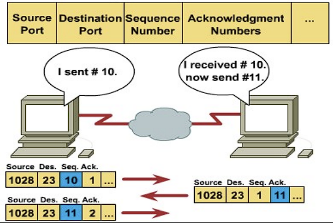
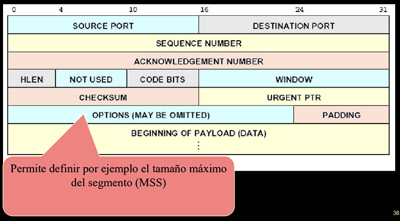

# Parcial 1

## Clase 1

### Ethernet/Internet - Conceptos básicos

#### Entrega con el mejor esfuerzo

El hardware no proporciona al emisor informaicón sobre si el paquete ha sido recibido.

#### Tecnología de difusión

Todas las estaciones comparten un canal.

#### Control de acceso distribuido

Usa esquema CSMA/CD

#### Ethernet

  - Extremadamente popular
  - Puede correr sobre
    - Par trenzado
    - Fibra Optica
  - Tres generaciones
    - 10Base-T opera a 10Mbps
    - 100Base-T (fast Ethernet) opera a 100Mbps
    - 1000Base-T (gigabit Ethernet) opera a 1Gbps
  - IEEE standard es 802.3

## Clase 2

### Direcciones IP

#### Servicio Universal

Cualquier computadora puede comunicarse con cualquier cosa &rarr; Identificación única Universal

#### Identificación

- **Nombre**: Indica quién es
- **Dirección**: Indica dónde está
- **Ruta:**: Indica cómo llegar

**Dirección IP 32bits**

#### Direcciones IP

- Similares a las direcciones de hardware
- Unicas para cada host de Internet
- 32 bits
- Valores elegidos buscando un ruteo eficiente
- Se dividen en dos partes
  - Red
  - Host

#### Características deseables

- Compactas (pequeñas)
- Universales
- Independientes del hardware
- Esquema original
  - Esquema de clases

#### Direcciones A, B y C
##### Clases

#### Direcciones

- Las direcciones NO especifican una computadora sino una conexión a la red
- Cuando hostid = 0, nos referimos a la red
- Cuando hostid = 255 es la red de difusión
- Para rutear se utiliza el netid

#### Notación

#### Direcciones especiales

#### Limitaciones de IPv4

##### Crecimiento exponencial de Internet
- Agotamiento de direcciones
- Reúso mediante NAT
- Problema con dispositivos orientados a la conexión

##### Necesidad de configuraciones simples
- Requiere mucha configuración manual
- Salir de DHCP

##### Mejor soporte tiempo real
- IPv4 tiene funcionabilidad limitada
- No permite diferencias TCP de UDP en datagramas encriptados

#### Funcionabilidad de IPv6 1

##### Nuevo Header
- Minimiza procesamiento
- No es interoperable con IPv6
- Doble de long del de IPv4

##### Gran espacio de direcciones
- 128 bits vs 32 de IPv4
- Evita el uso de NAT

##### IPsec
- Mejora de seguridad
- Provee integridad y autenticación de datos

##### Prioridades
- Define clases de tráfico (como IPv4)
- Identificación en el Header &rarr; soporta encriptación de datos

##### Interacción entre nodos
- ICMPv6
- Mejora la interelación de nodos en el mismo enlace

##### Extensibilidad
- Permite extensiones de Header

### Direcciones

Con 128 bits se puede asignar 6.6 1023 direcciones / m2

#### Direcciones de 128bits
- 8 grupos de 16 bits en hexa

#### Omisión de ceros
- 2001:0db8:0000:130F:0000:0000:087C:140B
- 2001:0db8:0:130F::087C:140B

### Migración a IPv6
#### Red IPv6 paralla
- Separadas pero sobre un mismo medio
- A causa de las ventajas de IPv6 los usuarios se pasarían

#### Islas de IPv6
- Comenzar con "Islas" hasta que toda la red sea IPv6

#### Gateways
- Se transforma una versión en otra cuando sea necesario

### Unicast

### Tipos de direcciones IPv6
#### Unicast
Para un único nodo o interface

#### Multicast
Para grupos de nodos o interfaces

#### Anycast
Unicast a múltiples dispositivos

### Global Unicast Address Format

### Resolución de Direcciones

- Dos máquinas para comunicarse DEBEN conocer sus direcciones físicas
- Lo que el usuario conoce es la dirección IP

**Se necesita convertir de IP a MAC** &rarr; **ARP**

#### ARP (IPv6 no usa ARP)

- Permite que la computadora A encuentre la dirección de Hard de la computadora B
- Técnica: Se emite un pedido por Broadcast y se obtiene la respuesta

#### Solución en redes de difusión

### Encapsulación

### Formato mensaje ARP

### Encapsulación

### Caching

- Evita consultas reiteradas
- La tabla ARP se mantiene en cache
- Las entradas que pasan de tiempo se eliminan (típico 20 minutos)

### Reverse Address Resolution Protocol (RARP - Reverse ARP)

- Protocolo antiguo usado en máquinas sin disco rígido
- Obtiene la dirección IP propia de un servidor
- Viaja sobre la trama

#### Detalles

- Cada computadora se identifica a si misma
- Sólo es eficiente cuando el direccionamiento no cambia
- Casi completamente reemplazado por DHCP

## Clase 3

### Protocolo Internet (IP)

IP le permite al usuario pensar en internet como una única red virtual que interconecta todos los hosts, y a través la cual la comunicación es posible; su arquitectura subyacente es oculta e irrelevante.

### Capas conceptuales

### Paquete Internet

- Conocido como "Datagrama".
- Servicio NO orientado a la conexión
  - No arma un camino antes de la transmisión
- Header (Encabezado) + Payload (Datos)

### Formato IPv4

### Formato IPv6

#### Extensiones

- En IPv6 el Header tiene SOLO lo usable habitualmente
- Otra información en Extensiones
- NEXT HEADER apunta a la primera extensión
- Cada extensión se identifica con un valor

### Códigos

### Enlace de Headers

### Comparación IPv4 vs IPv6

### Qué cambió

- **Header Lengh**: Al no tener tamaño fijo no se necesita
- **Identificación/Flag/Fragment Offset**: En caso de ser necesario fragmentar, se indica en las Extensiones. Sólo fragmenta el origen.
- **CheckSum**: Se quita para aumentar el rendimiento, se deja el chequeo a las capas superiores.

### Encapsulado IPv4

### Maximum Transfer Unit

- Máximo tamaño de datagrama &rarr; El área máxima de data para Ethernet es 1500 octetos &rarr; Dividir el Datagrama en bloques (fragmentos).

### MTU IPv6

- Link MTU: MTU de la capa de enlace de datos.
- Path MTU: Mínimo MTU entre origen y destino.
- MTU min IPv6: 1280 Bytes &rarr; **MTU Discovery**

### MTU Path Discovery IPv6

- Encuentra el MTU del camino completo
- La fragmentación la maneja el origen
  - Libera del proceso a las redes
  - Aumenta la eficiencia
- Mínimo MTU 1280 octetos
  - Recomendado 1500 octetos
- Realizada por los ruteadores
- Los datagramas se dividen en datagramas más pequeños llamados fragmentos
- Los header de los fragmentos son del mismo formato que el original
- Cada fragmento se rutea independientemente
- El IPv6 los routers NO FRAGMENTAN

### Reensablado

- En destino final
- Timer
  - Cuando llega el primer fragmento se activa
  - Al finalizar se descarta el datagrama si no llego completamente

### Importante

> "La transmisión de un datagrama IP entre dos equipos en una red física única no involucra routers. El emisor encapsula el datagrama en una trama física, añade la ip de destino a una dirección física y envía la trama resultante directamente al destino."

---

### ICMP

- Mecanismo de reporte de errores
- Usado principalmente por los ruteadores
- También reportan funcionabilidades
- Corre sobre IP
- No producen nuevos mensajes de error
- Se informa solo al origen

### Encapsulamiento

### Mensaje ICMP

### Mensajes ICMP

## Clase 4 - Capa de Transporte

### Modelo

### TCP vs UDP Generalidad

#### UDP
- No orientado a la conexión
- Mejor esfuerzo

#### TCP
- Orientado a la conexión
- Más lento, pero más confiable

### **U**ser **D**atagram **P**rotocol

- Protocolo de capa de Transporte
- Servicio NO orientado a la conexión
- Trabaja al mejor esfuerzo
- La aplicación es responsable de corregir errores
- En caso que por tener error se descarte un datagrama, no se genera mensaje de error

### UDP

- Los puertos especifican los procesos
- IP especifica la computadora (la conexión)

### Responsabilidades

#### IP
 - Es responsable de transferir los datos entre hosts (delivery)

#### UDP
 - Es responsable de diferenciar entre fuentes y destinos dentro del host

### UDP CheckSum

- Los diseñadores decidieron hacer opcional la suma de verificación, a fin de permitir que las implantaciones <ins>**operen con poco trabajo computacional**</ins> cuando operen con UDP.

- De todas formas se recomienda su uso.

### Pseudo encabezado

- 12 Bytes
- Usado por UDP y TCP
- Permite un doble chequeo que el dato llegó al destino correcto.

### UDP Encapsulado

### Demultiplexado

#### Listado de puertos bien conocidos (algunos).

- 21 – FTP (TCP)
- 22 – SSH (TCP)
- 23 – Telnet (TCP)
- 25 – SMTP (TCP)
- 53 – DNS (TCP / UDP)
- 80 – HTTP (TCP)
- 123 – NTP (UDP)
- 161 – SNMP (UDP)
- 443 – HTTPS (TCP)
- 514 – SYSLOG (UDP)

#### Números de puertos

- Menores a 1024
  - Puerto "Bien Conocidos"
  - Utilizados por los servidores

- Mayores a 1024
  - No reservados
  - Utilizados por los clientes

### Características UDP

- UDP no puede conocer una dirección IP al menos que interactúe con la capa IP.
- UDP está fuertemente integrado al protocolo IP.
  - Se viola la idea de seperar funcionabilidad entre capas.
- El **multiplexado** y **demultiplexado** entre el software UDP y los programas de aplicación (SNMP) ocurre a través del mecanismo de **puertos**.
- Si un datagrama que recibe UDP no corresponde a uno de los puertos en uso, envía error ICMP: puerto no accesible y descarta el dastagrama.

### Socket

### Máximo Tamaño UDP

- Max datagrama &rarr; 65535 Bytes
- Header IP min 20 Byte, Header UDP = 8 Bytes
  - **MAX DATA UDP = 65507 Bytes**

**Las aplicaciones limitan a valores menores**

### Protocolo TCP

- Usa IP para transmitir datos a otra computadora.
- Ofrece un servicio de transferencia de datos eficiente y confiable a los programas de aplicación.
- Debe compensar pérdidas y retardos sin sobrecargar redes ni enrutadores.

### Características de TCP

- Orientado a la conexión
- Full Dúplex
- Fiable
- Flujo de Bytes controlado
- Segmentación
- Transmisión uno a uno

#### Confiable

- Logra confiabilidad mediante ACK
  - El receptor envía ACK cuando llegan los datos
  - El emisor inicia un timer con la emisión
  - Si no llega el ACK se reenvían los datos

#### Fases de TCP

- Establecimiento de conexión
- Transferencia de Datos
- Cierre de Conexión

#### Nro Secuencia

### Ventana Corrediza

- Permite el envío de múltiples paquetes
- Con cada ACK se desplaza la Ventana

### Encapsulación TCP

### Formato de trama

#### Opciones

#### Pseudo Header

Al igual que en UDP, permite que el receptor verifique que el segmento llegó a su destino correcto.

### Protocolo TCP Terminal a Terminal

### Qué ofrece TCP?

- Es tarea de TCP asegurar que los datos se entreguen:
  - Fiablemente
  - En Secuencia
  - Sin errores

- TCP permite saber si un datagrama llegó adecuadamente al host receptor.
  - Señales de acuse de recibo.

- El tráfico enviado al puerto j de UDP es distinto al tráfico enviado al puerto j de TCP.

### Fragmentación y Checksum

- TCP está implementado en muchos tipos de redes, &rarr; a distinta velocidad y que distintos tamaños de datagramas.
- TCP negocia el tamaño del datagrama a enviar.
- El datagrama puede pasar por redes de menor tamaño, con lo cual se tendrá que fragmentar el datagrama para que pueda pasar por esa red.

### Viaje en redondo - tiempo

- **RTT = A * RTT + (1-A) NRTT**
  - A varía entre 0 y 1 según la sensibilidad al cambio de la red.
  - NRTT es el último valor de RTT medido

## Clase 9 - Enrutamiento

### Consideraciones de diseño

- Conmutación de paquetes Store-and-Forward

- Provee servicios a la Capa Transporte

- Servicios (deben ser independientes de la tecnología del routeador)
  - Orientados a la conexión
  - NO orientados a la conexión

### Comparación de subneteos

### Dominios de Enrutamiento

- Entidad administrativa
- Tiene redes y subredes asociadas
- Limita la diseminacion de la información de ruteo
- Relacionada con la administración de seguridad
  - En sus límites ses suelen encontrar los firewall

### Sistemas Autónomos

- Sistema Autónomo
  - Grupo de redes administradas como un todo
  - Ej: Redes de Camputs, Hospitales grandes, etc.
  - Las redes están conectadas entre sí por ruteadores con mecanismos propios

- Los SA se identifican mediante un número
  - Números desde 1 a 65535
  - Mediante el número se determinan cómo se alcanzan unos a otros

- Los SA se pueden subdivir en áreas

### Protocolos Internos y Externos

#### Descubrimiento de ruta

- Para poder llegar de un lugar a otro de la red
- Se busca la mejor ruta &rarr; Basado en que se considera importante

### Forwarding y routing

- Reenvío: Usa la tabla de ruteo para la decisión de encaminamiento
- Enrutamiento: Adquiere el conocimiento para crear la tabla de ruteo

### Característica de un algoritmo de ruteo

- Exacto
  - Calcula correctamente la mejor ruta
- Simple
  - Poco consumo de recursos
- Robusto
  - En caso de mucho tráfico no debe fallar
- Convergente
  - Se reconfigura rápidamente
- Flexible
  - Debe soportar diferentes métricas

#### Algoritmos

- **No adaptativos** &rarr; Toman la decisión por adelantado sin mediciones de campo
- **Adaptativos** &rarr; Las decisiones reflejan los cambios de topología y tráfico

### Protocolos de Ruteo (Histórico)

- GGP (Gateway to Gateway Protocol)
  - Fuera de uso
- EGP (External Gateway Protocol)
  - Reemplazo del anterior, también fuera de uso
- RIP (Routing Information Protocol)
  - Varias versiones, aun en uso en LAN
- OSPF (Open Shortest Path First)
  - Ampliamente usado actualmente
- BGP (Border Gateway Protocol)
  - Usado entre dominios ISP
- IGRP, EIGRP
  - Propietarios CISCO

### Algoritmos importantes

- The Optimality Principle
- Shortest Path Routing
- Flooding
- Distance Vector Routing
- Link State Routing
- Hierarchical Routing
- Broadcast Routing
- Multicast Routing
- Routing for Mobile Hosts
- Routing in Ad Hoc Networks

#### Arbol 

***Sólo un camnio para ir desde cualquier nodo a cualquier otro nodo (no hay loops)*** 

***El grupo de rutas óptimas de todos los prigenes a un destino forman un ARBOL*** 

#### Ruta más corta (A -> D)

1. Iniciamos con el nodo origen ( A ) como único integrante del árbol
2. Buscamos en nodos vecinos al árbol ( por ahora solo B y G ) el menor costo al origen
  - En el EJ:
  - B = 2 ( menor costo )
  - G = 6
3. Marcamos en nodo de menor costo ( B ) como formando parte del ARBOL
4. El árbol esta formado ahora por A y B

#### Inundación (Flooding)

- Cada paquete de entrada se reenvía a todas las salidas menos aquella por la que llego
- Desventajas: Genera gran cantidad de paquetes
  - Contador de saltos, al llegar a cero elimina el paquete.
  - Registro de paquetes difundidos, para no enviarlos por segunda vez
  - Reenviar solo por líneas que van en la dirección aproximada del destino.
- Ventajas
  - Robusto
  - Retardo mas corto

### Protocolos de Ruteo

DOS Tipos

- Vector Distancia
  - Busca el menor número de saltos entre origen y destino
  - Calculado por cada ruteador
  - Distancia = número de saltos

- Estado de enlace
  - Asigna un valor (métrica) a cada enlace
  - El camino  elegido es el que sume menor métrica
  - Cada ruteador implementa el algoritmo basándose en la misma base de datos que todos ayudan a construir

### Vector - Distancia

- Dinámico (adaptativo)
- Cada routeador mantiene una tabla con la mejor ruta conocida a cada destino y la línea a llegar.
- Bellman -Ford / Ford-Fulkerson
- Cada T ms c/ruteador envía tablas a sus vecinos (típico: 30seg)
- Usa Computación Distribuida
  - Cada ruteador calcula la "mejor" ruta independientemente de los demás
  - Cada ruteador notifica a sus vecinos el mejor camino

### Up-Date de Vector-Distancia

### Estado de Enlace

- Cada ruteador anuncia el estado de sus interfaces a los vecinos
- Se asigna un costo a cada link
- La información de ruteo se usa para crear una base de datos que refleje la topología de la red

#### Válido para cada ruteador:
- Descubre a sus vecinos y aprende las direcciones de red
- Mide el retardo o costo a cada vecino
- Arma un paquete con todo lo aprendido
- Envía el paquete a otros ruteadores
- Computa el camino más corto a otros ruteadores.

> Cada ruteador conoce la topología completa de la red

### Difusión

> Enviar mensajes a todos (o varios) hosts

- Enviar un paquete a cada uno de los hosts
  - Desperdicia ancho de banda
  - Requiere una lista de hosts
- Inundación
  - Generada por los demasiados paquetes
  - Consume ancho de banda
- Enrutamiento multidestino
  - Cada paquete con lista de destinos, el ruteador cuando reenvía incluye sólos los destinos que puede alcanzar, luego de una cantidad de saltos los paquetes tienen sólo un destino.
- Arbol de expansión
  - Se reenvía al árbol de expansión.

### Multidifusión

- Envío de mensajes a Grupos predeterminados
- Cada ruteador debe saber cuáles de sus hosts pertencen a qué grupos
- Procedimiento:
  - Cada ruteador calcular el árbol de expansión
  - Se recorta el árbol eliminando líneas que no sean del grupo
